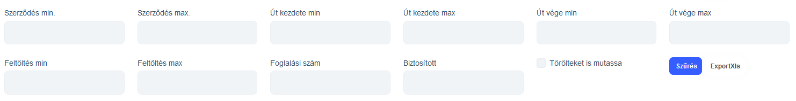
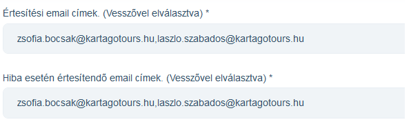
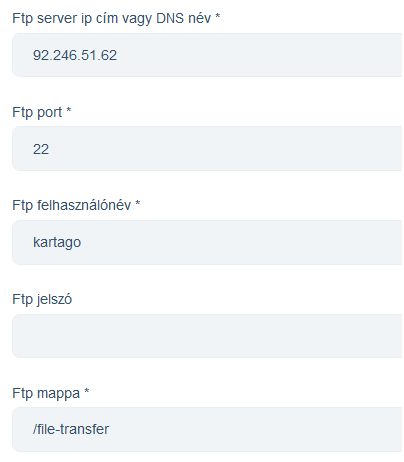
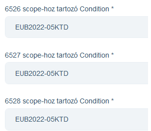

# EUB

Az EUB modul az EUB biztosító részére adatszolgáltatást biztosít.

AZ EUB rendszer működése:

## Adatbetöltés

Az ATCOM rendszerből exportált XLSX adatokat a rendszerbe kell tölteni.

### Betöltés indítása

"XLSX Uload" feliratnál a "Tallózás..." gombbal ki tudjuk választan az ATCOM rendszer által exportált XLSX kiterjesztású adatfilet.
A sor végén az "Upload" gombbal elindíthatjuk a betöltést!

> Figyeli, hogy ne legyen adat ismétlődés, vagyis akár ugyan azt az export file-t is be lehet tölteni, a rendszernek nem okoz gondot.

> A rendszer figyeli az ATCOM verzió számot. Amennyiben új verzió számmal jön adat, de az adat az EUB szempontjából nem változik, akkor a verziószámot lefrissíti a rendszer, de EUB beküldendő adat nem generálódik!

Az adatbetöltés hosszú ideig is eltarthat, ezért a feldolgozás a szerveren a háttérben történik. Amennyiben a weboldalt nem zárjuk be, vagy a feldolgozás vége előtt ismét megnyitjuk,akkor a képernyőre üzenet formályában kapunk értesítést, hogy a feldolgozás befejeződött. Ha több gépen is nyitva van az oldal, akkor minden oldalon megjelenik az üzenet.

A feldolgozás megkezdéséről és befejezéséről a beállított emailcímekre email értesítést is küld a rendszer.

## Betöltött adatok megtekintése

A képernyőn a betöltés sor alatt a szűrés rész található. A mezőket kitöltve majd a "Szűrés" gombra kattintva tudjuk az adatokat szűrni, ami a képernyő alsó részén lévő táblázatban láthatunk.

> Alapértelmezetten minden adat látszódik!

> Alapértelmezetten az EUB-nak nem beküldött adat sorai kiszínezve jelnnek meg, amiből azonnal láthatjuk, hogy van beküldendő adat.

## Betöltött adatok exportálása

Lehetőség van rá, hogy a szűrt adatokat XLSX fileba mentsük. Az exportált adatok a teljes szúrt sorra vonatkoznak, aminek száma a táblázat alján a lapozó sorban látható.

> Vegyük figyelembe, hogy több ezer sor exportálása esetén akár perceket is várni kell az eredményre! Ha lehet csak leszúrt max pár száz sort exportáljunk!

## Küldés az EUB részére

A "Küldés az EUB-nak" gombra kattintással, a rendszer egy EUB formátumnak megfelelő CSV filet-t készít és az elkészült file-t az EUB FTP szerverére fel is tölti. A feltöltés tényéről emailben és képernyő üzenetben értesítést küld a rendszer.

> Az elküldött adatról a szerveren másolat is készül, ami a rendszerből nem elérhető, adminisztrátor éri el hibakeresés céljából szükség esetén.

> Amennyiben nincs egyetlen még nem elküldött adat sem, a rendszer nem küld semmit, nem kült üres adatcsomagot!

> Maga a gomb és a funkció csak az arra jogosult felhasználóknak érhető el!

## Összes adat

Az összes adat gommbal, EUB formátumú CSV fileba ki lehet másolni a teljes adatbázist. Ez hibakeresési, EUB-al történő egyeztetési céllal van, normál esetben ne kell használni.

> Maga a gomb és a funkció csak az arra jogosult felhasználóknak érhető el!

## Beállítások

Az arra jogosult felhasználóknak a rendszer beállításainál elérhető az EUB rész.

### Értesítések

Email értesítések címzettjeit tudjuk beállítani. Külön a normál, és külön a hiba esetén értesítendők sorolhatóak fel.

### FTP szerver

Az EUB-nak FTP szerverre kell az adatokat feltölteni. Ennek beállításait lehet megadni ezen a részen.

### Scope beállítások

Az EUB szerződésben a különböző Scope-okat időről időre változó Condition értékkel azonosítjuk. Rendszerint évforduló esetén változhat az egyes Scope értékhez tartozó Condition azonosító.

Ezen előre definiált Scope-okhoz tudjuk az érvényben lévő Condition értékeket beállítani.

