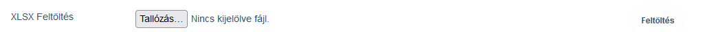

# EUB

The EUB module provides data reporting for the EUB insurer.

How the EUB system works:

## Data loading

XLSX data exported from the ATCOM system must be loaded into the system.

### Start loading

At "XLSX Uload", click on the "Browse..." button to select the XLSX data file with the XLSX extension exported by the ATCOM system.
At the end of the line, click on "Upload" to start the loading!

> Make sure that there are no data repetitions, i.e. you can load the same export file, the system will not have any problems.

> The system monitors the ATCOM version number. If data comes with a new version number, but the data does not change for the EUB, the system updates the version number, but no data to be submitted to the EUB is generated!

Data loading may take a long time, so processing on the server is done in the background. If the web page is not closed or reopened before the end of processing, a message will be displayed on the screen informing you that the processing is finished. If the page is open on more than one machine, the message will be displayed on each machine.

An email notification of the start and end of processing will also be sent to the email addresses you have set.

## View uploaded data

On the screen, under the loading line, you will find the filtering section. By filling in the fields and then clicking on the "Filter" button, we can filter the data, which is shown in the table at the bottom of the screen.

> By default all data is visible!

> By default, the rows of data not submitted to the EUB are highlighted, which immediately shows that there is data to submit.

## Export uploaded data

It is possible to save the filtered data to an XLSX file. The exported data will be for the entire filtered row, the number of which is shown in the tab row at the bottom of the table.

> Please note that when exporting thousands of rows, you may have to wait up to minutes for the result! If possible, export only drilled rows - a few hundred rows max!

## Send to the EUB

By clicking on the "Send to EUB" button, the system will create a CSV file in the EUB format and upload the file to the EUB FTP server. The system will notify you of the upload via email and screen message.

> A copy of the sent data is also made on the server, which is not accessible from the system, but can be accessed by an administrator for debugging purposes if necessary.

> If there is no data not yet sent, the system does not send anything, no empty data packet is sent!

> The button and the function itself is only available to authorised users!

## All data

All data can be copied to a CSV file in EUB format. This is for debugging, reconciliation with EUB, not normally used.

> The button and the function itself is only available to authorised users!

## Settings

For authorised users, the EUB section is available in the system settings.

### Notifications

We can set the recipients of email notifications. Separate ones for normal and separate ones for error notifications can be listed.

### FTP server

The EUB must upload the data to an FTP server. Its settings can be configured in this section.

### Scope settings

The different Scopes in the EUB contract are identified by a Condition value that changes from time to time. Normally, the Condition identifier associated with each Scope value may change on an anniversary.

For these pre-defined Scopes we can set the current Condition values.

