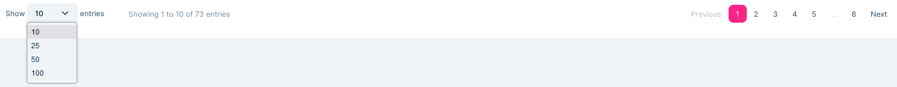
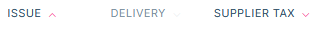

# Invoices

The invoices function allows you to view the invoices that have been entered into the system.
Invoices are entered in the system in 3 ways:

1. from the NAV Online Invoice system (these invoices cannot be modified, only the reference number can be added if the invoice number was recorded differently in the SAP system.)
2. automatically generated invoices from SAP (these invoices must be corrected!)
3. Invoice recorded manually.

## Search, filter, navigation

At the top of the page is the filtering panel, where you have a number of filtering options:

For the value of supplier and customer it is not necessary to enter the exact full name, part of the company name is sufficient.

Tax number can also be searched with a tax number section

You can also filter for installation and issue dates, you can specify start to end or both dates for filtering.

The source field specifies how the invoice was entered into the system.

At any one time you can either see only incoming invoices (incoming field unchecked) or only outgoing invoices (incoming field unchecked)

For incoming invoices, we see the column for the vendor name and tax number, but not the vendor, because it is us for all of them, by definition.

For outgoing invoices, we see the name and tax number column for the customer, but not the supplier, because by definition they are us.

> For outgoing invoices, if the buyer is not a taxable person, the tax number is blank. The customer name is also blank if the invoice data came from the NAV Online invoicing system, as due to GDPR the customer data is not transferred to the tax authority even if the customer is not a taxable person.

The **Only with open messages** field is checked by default. This means that only invoices where there are unresolved errors are displayed and the system is waiting for correction.

The change is made by pressing the **Filter** button.

At the bottom of the page, you can set the number of accounts to be displayed at a time in the navigation bar. And on the right, scroll.

At the end of the invoice column header namesare arrows indicating sorting. Clicking on the column name will sort the invoices in ascending order by the selected column. Clicking again will sort the rows in descending order.

SHIFT+Click to sort the data by multiple fields at the same time.

## Record new invoice

Click on the **New Invoice** button to record an invoice.

You can save only if all mandatory values are filled in.
If you are recording an invoice that is already in the database, you cannot save the invoice. It is also not possible to save an invoice whose invoice number is already entered in the reference field of another invoice (of course this is for a specific supplier).

> For a modifying invoice, the "Original invoice number" field must be filled in. If you enter an invoice number here that is not in the system (and you do not want to include it), tick the --Modifying invoice without original invoice** box.

> Please note that if there is a group tax number on the invoice, please fill in this field, otherwise the tax number check will fail.

## Change account

At the beginning of an invoice with the **Edit** menu item

Invoices can only be partially modified, not all fields can be modified. According to the source of the invoice, the options are

### Modify NAV invoices

These invoices cannot be modified. The modify field will come up, but we can only correct the **Sort ID** field. All other modifications will be rejected without an error message.

### Modify SAP and manually recorded invoices

All modification fields can be used here.

> When making a modification, please note that neither the **Invoice number** nor the **Sort ID** field can be duplicated for a given supplier.

## Delete invoice

At the beginning of the invoice with **Delete**.

> NAV invoice cannot be deleted, the option will not appear there either

## Display account messages

An error may be generated when reading an SAP file for invoices. These errors are included in the invoice comments. These comments cannot be deleted but can be closed.
Unclosed comments can be filtered for invoices, so it is easy to see the tasks that still need to be done.

To see what tasks are pending with the invoice, select **messages**.

If messages are still active when displayed **Save** and **Close** options are available.

Once completed, the **Save** button will close and the messages will become inactive.
If you have not completed the tasks, use the **Close** button, because this way you will not forget the tasks.

## Comparative filtering

This is a quick function. Whichever invoice you select will be filtered to the invoice's tax number, excluding all other filtering. This allows us to quickly check the existence of SAP and NAV invoices for the invoice.

## Incorrect SAP line

This function is used to mark the invoice (only applicable to SAP invoices) as incorrect.

When an invoice is recorded in SAP with the wrong tax number, it cannot be passed on to NAV. In SAP, however, it cannot be corrected in that quarter because it is closed. In other words, the SAP export is included in any case, but it must not be transferred to NAV. These invoices that are recorded but not to be transferred can be marked as incorrect, so the system does not copy them into the NAV submission.

It cannot be deleted from this system because the system would recreate it the next time it is loaded.