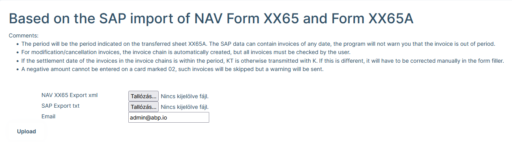

# XX65M Lapok

Ez a funkció az SAP rendszerből kapott txt formátumú export file és a  NAV ÁNYK rendszeréből kiexportált xx65 nyomtatvány XML file alapján kitölti az xx65M lapokat. 

## XX65 lap

### Mi az az xx65 lap?

Az xx az évet jelöli. 2021-ben 21 az értéke, vagyis a 2021-es bevallások esetében a 65-ös számú lapokat a 2165 sorszámmal jelölk.
Nyilván a 2022 évben ez 2265. 

A 65-ös lapok tartalmaznak A és M jelölésű oldalakat. A program ezen funkciója az M lapokat tölti ki, ehhez kell egy alap 65 lap exportja.

### xx65 file exportálása ÁNYK rendszerből

A program működéséhez kell egy előkészített 65 lap (2021-ben 2165 számű), ahol minimálisan a beadó cég adatait ki kell tölteni. Ez a cégnevet és az adószámot jelenti.
Lehet további adatokat is kitölteni (2165A lapok), ez a rendszer működését nem érinti, csak azokhoz a mezőkhöz nyúl az A lapon, ami az M lapokból adódó összesítés miatt kell tölteni.

Az így előkészített 65-ös lapot az  ÁNYK rendszerből a **Szervíz/Fejlesztőknek/Teszt XML file készítése** menüponttal lehet exportálni.

Az export a helyi gépen a felhasználó mappájában az ````AbevJava\import\pelda.xml```` helyre kerül. 

> Teljes példa: ````c:\users\%felhasználónév%\abevjava\import\pelda.xml``` helyen van, ahol a %felhasználónév% a bejelentkezett felhasználó fiók neve.

Ezt a filet kell majd becsatolni a progrmanak.


##  SAP export

### Mi az az SAP export

Az SAP export file tartalmazza az M lapok kitöltéséhez szükséges adatokat.

Formátuma kötött, csak a megfelelően előkészített export file felel meg a programnak.

Kérem ellenőrizze le, hogy a formátum az alábbi mintának megfelelő e:


Szintén fontos, hogy az utolsó oszlopban legyenek adószámok, mert a partnerek azonosítása adószám alapján történik.


## ´65 Lapok betöltése

A program indítása a pénzügy menüpont alatt:


A 2 db előkészített filet a megfelelő sorokba ki kell választani. Email értékét a rendszer automatikusan kitölti a bejelentkezett felhasználó beállításai alapján, de megadhatunk másik email címet is.

A **Feltöltés** gombbal indíthatjuk a programot.



A program azonnal átmegy [számlák](Finance/Invoices.md) modulra. Ekkor az adatfeldolgozás és betöltés nem történt meg, változás az adatokban nincs. A műveletet háttérfolyamat végzi és percekig is eltart. Amikor végez képernyő üzenetet küld, valamint emailben elküldi az eredményeket.


## Eredmény

A program futásának az eredménye egy email, ami 2 mellékletet tartalmaz. Egy hibalista, és egy XML file.

A hibalista a futás közben észlelt hibákat tartalmazza. Amíg olyan hibát tartalmaz a lista amit javítani kell, addíg az XML file nem pontos.

A hibalista végén egy külön részen azon hibák, amelyek a betöltött táblázatban nincsenek (nyitott üzenetek részen). Ez akkor lehetséges, ha a rendszer olyan számlasort talál, amit nem tud betölteni a táblázatba. Ilyen pl. a hibás vagy üres adószám. A rendszer csak ellenőrzötten jó adószámot enged meg, vagyis minden esetben a NAV rendszerében leellenőrzi az adószámot. Amennyiben ez sikertelen, a rendszer a számlát nem tudja felvenni, hiányozni fog a táblázatból.

Az XML filet, az ÁNYK rendszerbe kell betölteni. Az ÁNYK rendszerben minden megnyitott nyomtatványt be kell zárni, ekkor a ```` szervíz/Egyedi Importálás```` menüpont elérhető. Itt kell kiválasztani az emailből lementett XML file-t.

> betöltéskor a filetípusnál az XML-t válasszuk ki, különben nem fogjuk tudni kiválasztani a lementett file-t.


## Belső működés

A ´65 NAV nyomtatványokon az M jelölésű lapokat tölti ki a rendszer.
Minden szállító partnerről kell M lapot kiállítani, ezért fontos ismerni a szállító partner adatait (Neve, adószáma).
Minden partnerhez kell 02 és 02-K jelölésű aloldalakat is tölteni.

### 02 jelölésű M lapok

Meg kell adni egyesével a szállító számláit: számlaszám, a számlák kiállítási és teljesítési dátumait, számla nettó és áfa összegeit 1000 forintos egységekben.

### 02-K jelölésű lapok

Itt azokat a számlákat kell felsorolni, amik módosító számlák voltak ezért volt eredeti számla korábban.
Nem csak a visszaigénylésben érintett számlát kell felsorolni, hanem az eredeti és kiállítás sorrendjében az össze módosító számlát is. Külön jelölés van arra, ezek közül ebben a bevallásban melyiket vesszük figyelembe és melyeket vettük korábban már figyelembe.

> Új NAV iránymutatás alapján, ugyanazon gazdasági eseményre csak egyetlen számla lehet és ennek módosító számlái. Vagyis, amennyiben egy számlát teljesen lerontunk és új számlát állítunk ki, az új számlának hivatkoznia kell az eredeti számlára és ez a számla módosító számlának minősül. A rendszer viszont a számlákat úgy fogja figyelembe venni, ahogy a NAV-ba bent van, vagy ahogyan rögzítésre került. Ez alapján ha a partner nem az előírás szerint állítja ki a számlákat, akkor vagy befogadjuk hibásan és így is jelentjük a NAV felé, vagy nem fogadjuk be és a partnerrel javítattjuk.

### SAP adatok és a hibalehetőségek

Az SAP rendszerből egy szövegfileban jönnek az adatok. Ez alapján kapok adószámot ami a szállítót azonosítja, valamint számlaszámot és egy dátumot.

#### Számlaszám hiba
Az SAP rendszerbe kézzel rögzített számlák esetében lehetséges számlaszám hibák:
- Az SAP rendszer számlaszám mezője rövid, lehet nem fér be az eredeti számlaszám, ezért valahogy lerövidítve viszik be a rendszerbe
- Rögzítési hiba
- Üres karakterek vagy határoló jelek kiamaradnak rögzítéskor

#### Dátum hiba
Az SAP rendszerből egyetlen teljesítési dátum jön át, viszont ez sem biztos, hogy a számlán szereplő dátum, hanem az a dátum, amelyik hónapra rögzítve lett. Az adóhatóságnak a pontos, számlán szereplő dátum kell.

#### Összeg hiba
Az SAP rendszerben a számla melletti összegek csak a visszaigényelt értékeket tartalmazzák de a bevallásban a számlán szereplő teljes összeget kell feltüntetni.

#### Számla duplikáció
Az SAP rendszerben ugyan az a számlaszám többször is előzordulhat, amennyiben többféle áfa százalékos értékű tételt is tartalmaz. A NAV rendszerébe egy számlát csak egyszer szabad átadni

### SAP Hibák javítása

Az SAP rendszerből jövő adatokban lévő hibalehetőségek egy részét a rendszer automatikusan javítja, más részéhez felhasználói beavatkozás szükséges. Ahhoz, hogy a számlákat átadható módon nyilvántartsuk, kell egy adatbázis, ahol szerepelnek a számlák a pontos adatokkal.

#### Számla adatbázis

A rendszer tartalmaz egy [számla](/Finance/Invoices.md) adatbázist, ahol az összes számla szerepel. Az adatbázis össze van kötve a NAV online számla rendszerével, ezért elméletileg az összes belföldi számlát tartalmazza a rendszer méghozzá a pontos adatokkal.

Azokat a számlákat amelyeket az adatbázis nem tartalmazza az SAP adatai alapján a rendszer automatikusan előrögzíti. Ez hiányos és nem pontos, ezért az eredeti számla alapján javítani kell.

#### Hibakezelés

A számlákhoz a rendszer hibakezelési megjegyzést fűz. Minden ilyen hibát ellenőrizni/javítani kell. Ha minden megjegyzés javítva van, akkor a megjegyzéseket le lehet zárni, így nyomon lehet követni, melyik hibát kezeltük. 
Az összes hiba kezelése után az ismételt program futtatáskor hiba nélküli listát kapunk, ekkor az elkészült nyomtatvány használható.

#### Számlaszám hiba

A rendszer megpróbálja a rövidített, tévesen rögzített számlaszámhoz a számla adatbázisban a megfelelő számlát kiválasztani. Amennyiben talált megfelelően hasonló számlaszámot, az SAP számlaszámot hozzárendeli az adatbázisban szereplő számlával. Mivel ebben lehet hiba, ellenőrizni kell! Amennyiben az összerendelés hibás, törölni kell az összerendelést és vagy javítani az összerendelést, vagy amennyiben nincs megfelelő számla, akkor kézzel rögzíteni kell.

#### Dátum hibák

Azoknál a számláknál ahol a rendszer SAP adatokból rögzítette a számlát le kell ellenőrizni és javítani kell a számla dátumait.

#### Összeg hibák

Azoknál a számláknál ahol a rendszer SAP adatokból rögzítette a számlát le kell ellenőrizni és javítani kell a számla nettó és ÁFA összegeit.
