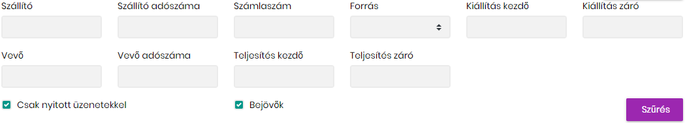
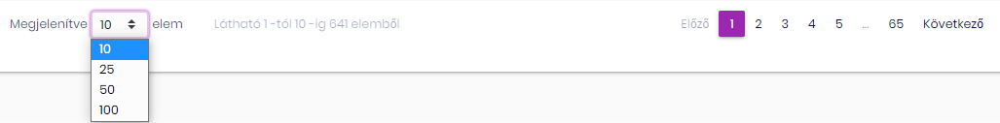
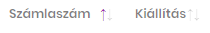
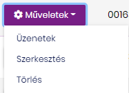
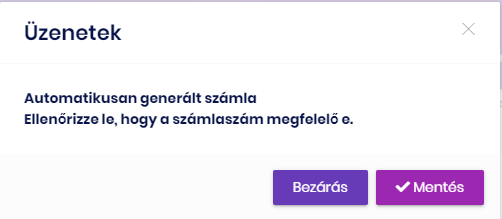
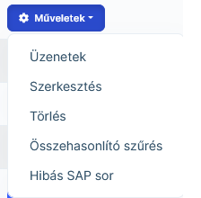

# Számlák

A számlák funkciókban lehet megnézni a rendszerbe rögzített számlákat.
A számlák 3 módon kerülnek a rendszerbe:

1. NAV Online számla rendszeréből (ezek a számlák nem módosíthatóak, csak a hivatkozási számmal egészíthető ki, amennyiben az SAP rendszerben máshogy volt rögzítve a számlaszám.)
2. SAP rendszerből automatikusan generált számla. (Ezeket a számlákat javítani kell!)
3. Manuálisan rögzített számla.

## Keresés, szűrés, navigáció

Az oldal tetején a szűrés panel található, ahol számos szűrési lehetőségünk van:

A szállító és vevő értékéhez nem szükséges pontos teljes nevet írni, elegendő egy része a cég nevének.

Adószám is kereshető adószám részlettel

Telejsítési és kiállítsi dátumokra is lehet szűrni, megadható a kezdő a záró vagy mindkét dátum a szűréshez.

A forrás mező megadja, hogy hogy került a rendszerba a számla.

Egy időben vagy csak a bejövő számlákat látjuk (bejövő mező ki van pipálva), vagy csak a kimenő számlákat (a bejövő mező nincs kipipálva)

Bejövő számláknál a szállító neve és adószáma oszlopot látjuk, a veőét nem, mert értelem szerűen az mindnél mi vagyunk.

Kimenő számlánál a vevő neve és adószáma oszlopot látjuk, a szállító nem, hiszen értelem szerűen azok mi vagyunk.

> Kimenő számlánál amennyiben nem adóalany a vevő az adószám üres. A vevő neve is üres abban az esetben, ha a számla adatait a NAV Online számlázó rendszeréből jött, mivel a GDPR miatt a vevői adatok nem adóalany esetén át sem kerülnek az adóhatósághoz.

A **Csak nyitott üzenetekkel** mező alapértelmezetten be van kapcsolva. Ez azt jelenti, cak azok a számlák jelennek meg, ahol vannak nem kezelt hibák, és a rendszer vár a javításra.

A **Szűrés** gomb megnyomásával történik meg a változtatás.

Az oldal alján lehet a navigációs sávon az egy időben megjelenő számlák számát beállítani. A jobb oldalon pedig lapozni.

A számla oszlopok fejléc nevei végénvannak a rendezést jelölő nyilak. Az oszlop névre kattintva, a kiválasztott oszlop szerint növekvő sorbarendezi a számlákat. Ismételt kattintásra csökkenő sorrendbe rendezi a sorokat.

SHIFT+Kattintásra több mező szerint is sorrendbe rendezhetjük az adatokat egyidőben.

## Új számla rögzítése

Az **Új számla** gombra kattintva lehet számlát rögzíteni.

Menteni csak akkor lehet, ha minden kötelező érték ki van töltve.
Ha olyan számlát rögzítenénk, ami már szerepel az adatbázisban, akkor nem lehet a számlát menteni. Szintén nem lehet olyan számlát meneteni aminek számlaszáma már szerepel egy másik számla referencia mezőjében. (Természetesen ez adott szállító esetében értendő).

> Módosító számla esetében ki kell tölteni az "Eredeti számlaszám" mezőt. Amennyiben ide olyan számlaszámot írunk, ami nem szerepel a rendszerben (és nem is akarjuk szerepeltetni), akkor pipáljuk be a --Módosító számla eredeti számla nélkül** mezőt.

> Figyeljünk oda, hogy amennyiben csoport adószám van a számlán megadva, akkor azt a mezőt töltsük ki, különben hibás lesz az adószám ellenőrzés.

## Számla módosítása

Az adott számla elején a **Szerkesztés** meüponttal

A számlákat csak részben lehet módosítani, nem minden mező módosítása megengedett. A számlák forrása szerint a lehetőségek

### NAV számlák módosítása

Ezeket a számlákat nem tudjuk módosítani. A modosítás mező feljön, de csak a **Saját azonosító** mezőt tudjuk javítani. A többi módosítás hibaüzenet nélkül elvetésre kerül.

### SAP és manuálisan rögzített számlák módosítása

Itt minden módosító mező használható.

> Módosításnál vegyük figyelembe, hogy adott szállítónál nem lehet duplikált sem a **Számlaszám** sem a **Saját azonosító** mező.

## Számla törlése

Az adott számla elején a **Törlés** meüponttal

> NAV számla nem törölhető, ott a lehetőség sem jelenik meg

## Számla üzeneteinek megjelenítése

SAP file beolvasásakor a számlákhoz generálódhat hiba. Ezek a hibák bekerülnek a számla megjegyzéseihez. Ezek a megjegyzések nem törölhetőek, de lezárhatóak.
A nem lezárt megjegyzésekre lehet szűrni a számlákat, ezért könnyen tudjuk látni a még meglévő elintézendő feladatokat.

Ahhoz, hogy lássuk milyen feladat van a számlával, az **üzenetek** menüponttot válasszuk ki.

Ha az üzenetek még aktívak megjelenítéskor **Mentés** és **Bezárás** lehetőségek vannak.

Ha elvégeztük a feladatokat, akkor a **Mentés** gombbal zárjuk le és így az üzenetek inaktívvá válnak.
Ha még nem végeztük el a feladatokat akkor a **Bezárás** gombot használjuk, mert így nem fogjuk elfelejteni a feladatokat.

## Összehasonlító szűrés

Ez egy gyorsfunkció. Amelyik számlán kiválasztjuk, ott a számla adószámára leszűrődik az adatbázis, minden más szűrést kivéve. Ezzel gyorsan tudjuk a számlához tartozó SAP és NAV számlák meglétét ellenőrizni.

## Hibás SAP sor

Ezzel a funkcióva az adott számla (csak SAP számlára alkalmazható) hibásnak jelölhető meg.

Amikor az SAP-ban egy számlát téves adószámra rögzítünk fel, akkor ezt így nem adthatjuk át a NAV-nak. Az SAP-ban viszont már abban a negyedévben nem lehet javítani, mert le van zárva. Vagyis az SAP export mindenképpen tartalmazza, de a NAV-ba mégsem szabad átadni. Ezeket a rögzített de nem átadandó számlákat tudjuk hibásnak jelölni, így a rendszer nem másolja be a NAV beadványba.

Törölni azért nem lehet ebből a rendszerből, mert a következő betöltéskor a rendszer újra létrehozná.

